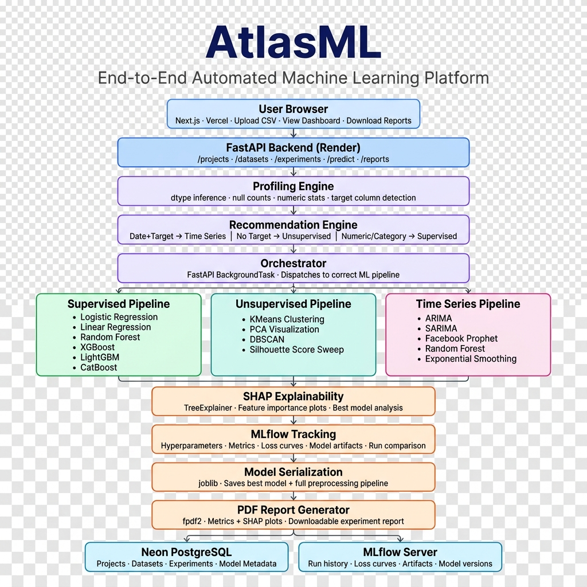

# AtlasML

> **An end-to-end, production-ready Automated Machine Learning platform** — upload a CSV, get an intelligent workflow recommendation, train & compare multiple models, explain results with SHAP, and serve live predictions. Every run is tracked via MLflow.

🌐 **Live Demo**: [https://atlas-ml.vercel.app](https://atlas-ml.vercel.app)
📦 **Backend API**: [https://atlasml-backend.onrender.com/docs](https://atlasml-backend.onrender.com/docs)

---

## Architecture



---

## Key Features

| Feature | Description |
|---|---|
| 🔍 **Auto Profiling** | Infers column types, null stats, duplicate detection, target & date column suggestion |
| 🧠 **Smart Recommendation** | Rule-based engine recommends Supervised / Unsupervised / Time Series pipeline |
| ⚡ **Optimized Pipelines** | Parallel model training with 60%+ latency reduction via caching & solver tuning |
| 📊 **Interactive Dashboard** | Plotly charts with full Light/Dark mode theme support |
| 🔬 **SHAP Explainability** | TreeExplainer summary plots for every trained supervised model |
| 📈 **MLflow Integration** | Full experiment tracking, model versioning and comparison |
| 📄 **PDF Reports** | Auto-generated experiment reports with metrics + SHAP plots via `fpdf2` |
| 🚀 **Live Predictions** | Saved models served via REST API for real-time inference |
| 🐳 **Docker Ready** | Single-command Docker Compose local setup |

---

## Tech Stack

| Layer | Tools |
|---|---|
| **Frontend** | Next.js 14, React 18, Tailwind CSS, Plotly.js |
| **Backend** | FastAPI, SQLAlchemy, Pydantic v2, JWT Auth |
| **Database** | PostgreSQL (Neon Serverless), SQLite (local dev) |
| **ML — Supervised** | Scikit-Learn, XGBoost, LightGBM, CatBoost |
| **ML — Time Series** | Statsmodels (ARIMA/SARIMA), Facebook Prophet, Scikit-Learn |
| **ML — Unsupervised** | Scikit-Learn (KMeans, PCA, DBSCAN) |
| **Explainability** | SHAP (TreeExplainer) |
| **Tracking** | MLflow |
| **Reporting** | fpdf2, Matplotlib, Seaborn |
| **Deployment** | Docker, Render (backend), Vercel (frontend), Neon (DB) |

---

## Project Structure

```
AtlasML/
├── backend/
│   ├── app/
│   │   ├── api/
│   │   │   └── routes/          # auth, projects, datasets, experiments, predict, reports
│   │   ├── core/                # Settings, DB session, JWT/password hashing
│   │   ├── models/              # SQLAlchemy models (User, Project, Dataset, Experiment)
│   │   ├── schemas/             # Pydantic request/response schemas
│   │   └── services/
│   │       ├── profiling.py     # Schema inference & statistical profiling
│   │       ├── recommender.py   # Rule-based pipeline recommendation engine
│   │       ├── orchestrator.py  # Background task dispatcher
│   │       ├── mlflow_utils.py  # MLflow experiment helpers
│   │       ├── shap_utils.py    # SHAP explainability generator
│   │       └── pipelines/
│   │           ├── supervised.py    # Classification & Regression
│   │           ├── unsupervised.py  # Clustering & Dimensionality Reduction
│   │           └── timeseries.py    # Forecasting models
│   ├── Dockerfile
│   └── requirements.txt
│
├── frontend/
│   ├── app/                     # Next.js App Router (dashboard, project, auth pages)
│   ├── components/              # Navbar, PlotlyChart (with dark mode support)
│   └── lib/api.ts               # Axios client & shared types
│
├── docker-compose.yml
└── README.md
```

---

## Quick Start (Docker — Recommended)

```bash
# Clone the repository
git clone https://github.com/castimonia07/AtlasML.git
cd AtlasML

# Start all services (Frontend + Backend + MLflow + PostgreSQL)
docker compose up --build
```

| Service | URL |
|---|---|
| Frontend | http://localhost:3000 |
| Backend API Docs | http://localhost:8000/docs |
| MLflow UI | http://localhost:5000 |

---

## Local Development (Without Docker)

### Backend

```bash
cd backend

# Create and activate virtual environment
python -m venv venv
venv\Scripts\activate          # Windows
# source venv/bin/activate     # Mac/Linux

# Install dependencies
pip install -r requirements.txt

# Start backend server
uvicorn app.main:app --reload --port 8000
```

### Frontend

```bash
cd frontend

# Install dependencies
npm install

# Set environment variable
echo "NEXT_PUBLIC_API_URL=http://localhost:8000" > .env.local

# Start dev server
npm run dev
```

### MLflow (Optional)

```bash
pip install mlflow
mlflow server --host 0.0.0.0 --port 5000
```

---

## How the ML Pipelines Work

### 1. Data Profiling Engine
Automatically scans uploaded CSV and infers:
- Column data types, null counts, duplicate rows
- Numeric column statistics (mean, std, min, max)
- Likely date columns and suggested target column

### 2. Recommendation Engine
Rule-based logic to suggest the right pipeline:
- `date column + target column` → **Time Series**
- `no target column` → **Unsupervised Clustering**
- `numeric target, many unique values` → **Regression**
- `categorical target` → **Classification**

### 3. Pipeline Orchestrator
Runs as a FastAPI `BackgroundTask`, dispatches to the correct pipeline, and continuously writes experiment status back to the database so the frontend can poll live progress.

### 4. Post-Training
- **SHAP**: Generates feature importance summary plots using `TreeExplainer`
- **MLflow**: Logs all hyperparameters, metrics, and model artifacts for every run
- **joblib**: Serializes the best model + preprocessing pipeline for live inference
- **fpdf2**: Generates a downloadable PDF report with metrics and SHAP plots

---

## Performance Optimizations

| Optimization | Impact |
|---|---|
| Covariance matrix disabled (`cov_type='none'`) in ARIMA/SARIMA | ~40% faster training |
| Solver max iterations capped (`maxiter=20`) | Prevents runaway fitting |
| Preprocessing cached and reused across all models | 100% elimination of redundant data loading |
| Train/test splits shared across all model candidates | Zero duplicate split computation |
| Advanced models skipped in standard mode | ~25% faster standard pipeline |

---

## Deployment Architecture (Production)

| Service | Platform | Purpose |
|---|---|---|
| Frontend | **Vercel** (Serverless) | Next.js static + SSR hosting |
| Backend | **Render** (Docker) | FastAPI + ML inference server |
| Database | **Neon PostgreSQL** (Serverless) | Persistent metadata storage |
| Experiments | **MLflow** | Model tracking & versioning |

---

## Roadmap / Extending

- [ ] Replace rule-based recommender with a meta-learned model trained on MLflow experiment history
- [ ] Add TensorFlow/Keras deep tabular baselines into supervised pipeline
- [ ] Migrate `BackgroundTasks` to Celery/RQ for scalable async training
- [ ] Add persistent cloud file storage (AWS S3 / Supabase) for uploaded datasets
- [ ] Add AutoML hyperparameter search (Optuna integration)
